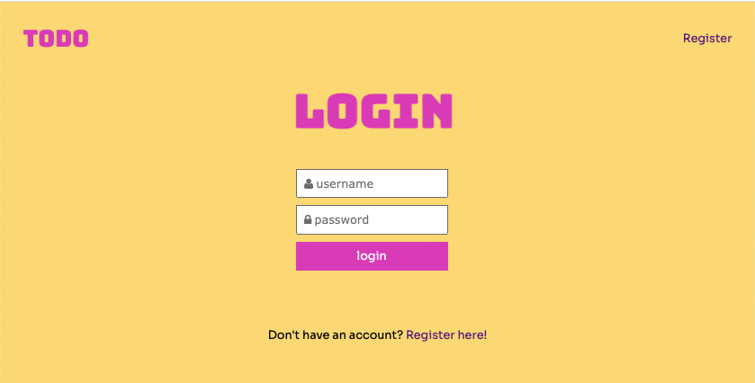
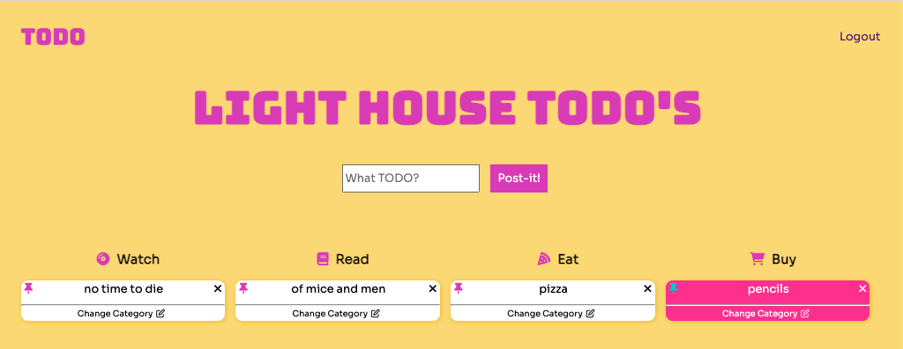
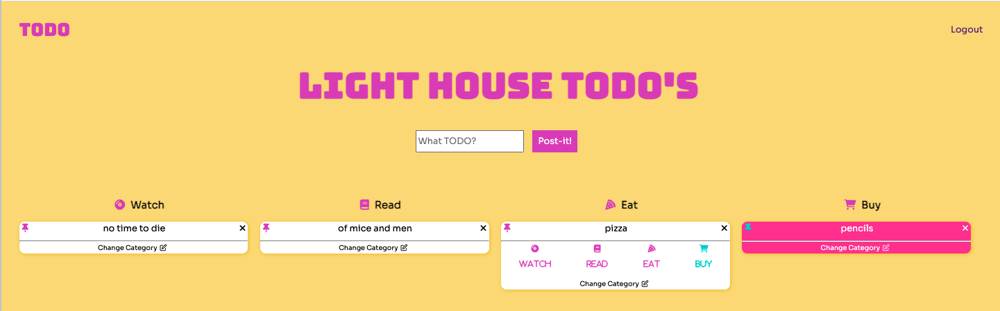
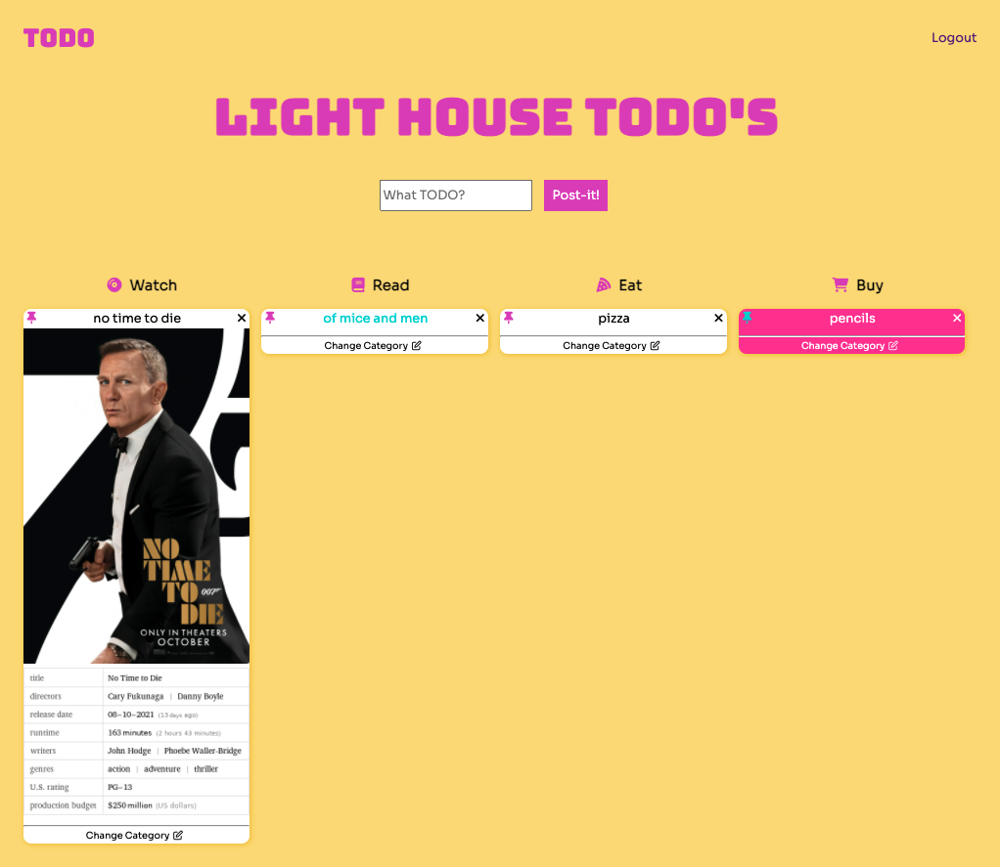
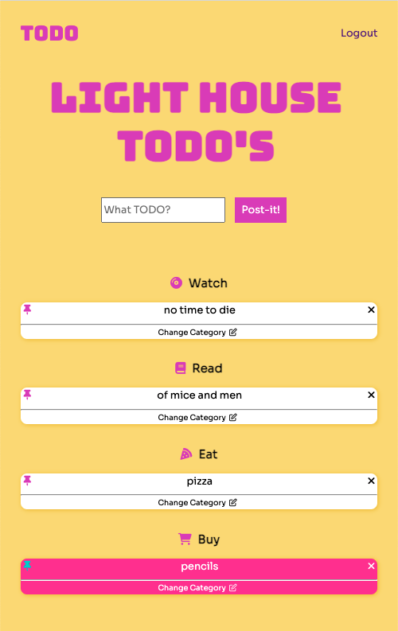

# TODO Project
 
TODO is a full stack web application built with Node and Express that allows users to create their own TODO list that are auto categorizing.

To create a TODO, type in your task into the `What TODO` input bar and it will automatically be categorized. Sometimes it might not be categorized correctly. However, you can simply change the category from our `Change Category` section below the TODO. 

To remove a task press the `x` in the top right corner of the TODO task.

Additionally users can tag tasks important and retrieve more information about their task with just a click!

Try it for yourself [here!](https://lighthouse-todo.herokuapp.com/)

## Final Product 

## Dependencies

- Node 10.x or above
- NPM 5.x or above
- Axios
- Body-parser
- Chalk
- Cookie-session
- Dotenv
- Ejs
- Express
- Morgan
- PG 6.x
- Pg-native
- Sass

## Getting Started

- Install all dependencies (using the `npm install` command).
- Create local database 
  - `psql -d template1`
  - CREATE ROLE labber WITH LOGIN password 'labber';
  - CREATE DATABASE midterm OWNER labber;
- Run the development web server using the `npm run local` command.
- Login page is only for display, press the login button to be logged in as user 1
- To view project visit `http://localhost:8080/login`

## Contributors 
- [Nikolaj Johansen](https://github.com/nikolajjuuel)

- [Shivangi Patodiya](https://github.com/shivangipatodiya)

- [Thomas Meyer](https://github.com/tmeyer01)

